<!-- README.md is generated from README.Rmd. Please edit that file -->

# Case Study: How Does a Bike-Share Navigate Speedy Success?

<!-- badges: start -->
<!-- badges: end -->

This project is the Capstone project that is part of the [Google Data
Analytics professional
certificate](https://www.coursera.org/professional-certificates/google-data-analytics)
in Coursera.

-   The project statements can be acess
    <a href="DAC8-Case-Study-1.pdf" target="here">here</a>.

-   Acess the the Rmarkdown document
    <a href="bikeshare_dac8.html" title="here">here</a>.

## Scenario

You are a junior data analyst working in the marketing analyst team at
Cyclistic, a bike-share company in Chicago. The director of marketing
believes the company’s future success depends on maximizing the number
of annual memberships. Therefore, your team wants to understand how
casual riders and annual members use Cyclistic bikes differently. From
these insights, your team will design a new marketing strategy to
convert casual riders into annual members. But first, Cyclistic
executives must approve your ecommendations, so they must be backed up
with compelling data insights and professional data visualizations.

## Ask Phase

**Guiding questions**

1.  What is the problem you are trying to solve?

    -   How do annual members and casual riders use Cyclistic bikes
        differently?

    -   Why would casual riders buy Cyclistic annual memberships?

    -   How can Cyclistic use digital media to influence casual riders
        to become members?

2.  How can your insights drive business decisions?

    -   improve the marketing campaign

3.  Identify the business task

    -   Undertand the diferente between casual users and members to
        improve the marketing campaign

4.  Consider key stakeholders

    -   Main stakeholders:

        -   Cyclistic executive team

        -   Lily Moreno

    -   Secundary stakeholder:

        -   Cyclistic marketing analytics team leader

## Prepare

1.  Where is your data located?

    -   [Cyclistic bikeshare
        database](https://divvy-tripdata.s3.amazonaws.com/index.html)

2.  How is the data organized?

    -   the data base is organized in 12 files with month data from july
        2020 to june 2021.

3.  Are there issues with bias or credibility in this data?

    -   Reliable -Yes, the data is reliable. The data is a primary
        source data based on a fictional company.

    -   Original - Yes, the original public data can be located.

    -   Comprehensive - Yes, no vital information is missing.

    -   Current - Yes, the data base is updated monyhly.

4.  How are you addressing licensing, privacy, security, and
    accessibility?

    -   the data is distributed in this
        [license](https://www.divvybikes.com/data-license-agreement).

5.  How did you verify the data’s integrity?

    -   Using R (ver. 4.1) and Rstudio (ver. 1.4)

6.  How does it help you answer your question?

    -   R is a powerful tool that makes it easy to manipulate large
        databases.

7.  Are there any problems with the data?

    -   Yes, Some missing values, but it did not interfere with the
        analysis.

## Process Phases

### Ingesting and filtering the data

-   Ingesting the data using the
    [vroom](https://vroom.r-lib.org/articles/vroom.html) library and
    loading into the bikeshare\_data.

<!-- -->

    #> database/202007-divvy-tripdata.csv database/202008-divvy-tripdata.csv 
    #> database/202009-divvy-tripdata.csv database/202010-divvy-tripdata.csv 
    #> database/202011-divvy-tripdata.csv database/202012-divvy-tripdata.csv 
    #> database/202101-divvy-tripdata.csv database/202102-divvy-tripdata.csv 
    #> database/202103-divvy-tripdata.csv database/202104-divvy-tripdata.csv 
    #> database/202105-divvy-tripdata.csv database/202106-divvy-tripdata.csv

    #> # A tibble: 6 × 13
    #>   ride_id          rideable_type started_at          ended_at            start_station_n…
    #>   <chr>            <chr>         <dttm>              <dttm>              <chr>           
    #> 1 762198876D69004D docked_bike   2020-07-09 15:22:02 2020-07-09 15:25:52 Ritchie Ct & Ba…
    #> 2 BEC9C9FBA0D4CF1B docked_bike   2020-07-24 23:56:30 2020-07-25 00:20:17 Halsted St & Ro…
    #> 3 D2FD8EA432C77EC1 docked_bike   2020-07-08 19:49:07 2020-07-08 19:56:22 Lake Shore Dr &…
    #> 4 54AE594E20B35881 docked_bike   2020-07-17 19:06:42 2020-07-17 19:27:38 LaSalle St & Il…
    #> 5 54025FDC7440B56F docked_bike   2020-07-04 10:39:57 2020-07-04 10:45:05 Lake Shore Dr &…
    #> 6 65636B619E24257F docked_bike   2020-07-28 16:33:03 2020-07-28 16:49:10 Fairbanks St & …
    #> # … with 8 more variables: start_station_id <chr>, end_station_name <chr>,
    #> #   end_station_id <chr>, start_lat <dbl>, start_lng <dbl>, end_lat <dbl>,
    #> #   end_lng <dbl>, member_casual <chr>

-   Filtering and Process the data using the tools in the
    [tidyverse](https://www.tidyverse.org/).

    -   In this fase we created the following variables:

        -   **trip\_duration** - the trip duration in minutes;

        -   **weekday\_day** - The day of the week the trip takes place;

        -   **is\_weekend** - Test if the day is a weekend;

        -   **date\_month** - Stores the month the trip takes place;

        -   **date\_hour** - Stores the hour the trip takes place;

        -   **date\_season -** Stores the season of the year;

        -   **day\_time -** Stores the time of the day;

        -   **trip\_route -** Stores the route of the trip (start
            station to end station).

    -   Then we keep the following variable:

        -   **start\_station\_name**;

        -   **ride\_id**;

        -   **rideable\_type;**

        -   **and member\_casual.**

    -   the we exclude the remaning original variables.

    -   then we change the class of the categorical variables to factor.

    -   then we excluse the missing data;

    -   And finally, we filter the data to contain only trip duration
        longer than 0 minutes.

-   Checking the data

<!-- -->

    #> Rows: 4,449,799
    #> Columns: 12
    #> $ ride_id            <chr> "762198876D69004D", "BEC9C9FBA0D4CF1B", "D2FD8EA432…
    #> $ rideable_type      <ord> docked_bike, docked_bike, docked_bike, docked_bike,…
    #> $ member_casual      <ord> member, member, casual, casual, member, casual, mem…
    #> $ trip_duration      <dbl> 3.833333, 23.783333, 7.250000, 20.933333, 5.133333,…
    #> $ weekday_day        <ord> qui, sex, qua, sex, sáb, ter, qui, seg, qui, seg, s…
    #> $ is_weekend         <ord> no, no, no, no, yes, no, no, no, no, no, no, no, no…
    #> $ date_month         <ord> jul, jul, jul, jul, jul, jul, jul, jul, jul, jul, j…
    #> $ date_hour          <ord> 15, 23, 19, 19, 10, 16, 11, 16, 11, 18, 15, 18, 9, …
    #> $ date_season        <ord> summer, summer, summer, summer, summer, summer, sum…
    #> $ day_time           <ord> afternoon, night, night, night, morning, afternoon,…
    #> $ start_station_name <chr> "Ritchie Ct & Banks St", "Halsted St & Roscoe St", …
    #> $ trip_route         <chr> "Ritchie Ct & Banks St to Wells St & Evergreen Ave"…

## Analyse Phase

-   First, we analyze the data broadly to see patterns, then group it by
    user type to see differences.

<!-- -->

    #> bikeshare_data 
    #> 
    #>  12  Variables      4449799  Observations
    #> --------------------------------------------------------------------------------
    #> ride_id 
    #>        n  missing distinct 
    #>  4449799        0  4449799 
    #> 
    #> lowest : 000001004784CD35 000002EBE159AE82 00001A81D056B01B 00001DCF2BC423F4 00001E17DEF40948
    #> highest: FFFFEE0233D826DE FFFFFB64C697B86A FFFFFB6DD39792F1 FFFFFC1045B11550 FFFFFF0C829D3E7A
    #> --------------------------------------------------------------------------------
    #> rideable_type 
    #>        n  missing distinct 
    #>  4449799        0        3 
    #>                                                     
    #> Value        docked_bike electric_bike  classic_bike
    #> Frequency        2040302       1130987       1278510
    #> Proportion         0.459         0.254         0.287
    #> --------------------------------------------------------------------------------
    #> member_casual 
    #>        n  missing distinct 
    #>  4449799        0        2 
    #>                           
    #> Value       member  casual
    #> Frequency  2523705 1926094
    #> Proportion   0.567   0.433
    #> --------------------------------------------------------------------------------
    #> trip_duration 
    #>        n  missing distinct     Info     Mean      Gmd      .05      .10 
    #>  4449799        0    26762        1     26.3    30.95     3.05     4.40 
    #>      .25      .50      .75      .90      .95 
    #>     7.55    13.68    25.18    44.02    68.63 
    #> 
    #> lowest : 1.666667e-02 3.333333e-02 5.000000e-02 6.666667e-02 8.333333e-02
    #> highest: 5.270138e+04 5.392160e+04 5.428335e+04 5.569168e+04 5.594415e+04
    #> --------------------------------------------------------------------------------
    #> weekday_day 
    #>        n  missing distinct 
    #>  4449799        0        7 
    #> 
    #> lowest : dom seg ter qua qui, highest: ter qua qui sex sáb
    #>                                                            
    #> Value         dom    seg    ter    qua    qui    sex    sáb
    #> Frequency  688506 545890 567474 603567 575301 654430 814631
    #> Proportion  0.155  0.123  0.128  0.136  0.129  0.147  0.183
    #> --------------------------------------------------------------------------------
    #> is_weekend 
    #>        n  missing distinct 
    #>  4449799        0        2 
    #>                           
    #> Value          yes      no
    #> Frequency  1503137 2946662
    #> Proportion   0.338   0.662
    #> --------------------------------------------------------------------------------
    #> date_month 
    #>        n  missing distinct 
    #>  4449799        0       12 
    #> 
    #> lowest : jan fev mar abr mai, highest: ago set out nov dez
    #>                                                                          
    #> Value         jan    fev    mar    abr    mai    jun    jul    ago    set
    #> Frequency   96828  49618 228484 337192 531579 729529 549665 619481 530767
    #> Proportion  0.022  0.011  0.051  0.076  0.119  0.164  0.124  0.139  0.119
    #>                                
    #> Value         out    nov    dez
    #> Frequency  386702 258823 131131
    #> Proportion  0.087  0.058  0.029
    #> --------------------------------------------------------------------------------
    #> date_hour 
    #>        n  missing distinct 
    #>  4449799        0       24 
    #> 
    #> lowest : 0  1  2  3  4 , highest: 19 20 21 22 23
    #> --------------------------------------------------------------------------------
    #> date_season 
    #>        n  missing distinct 
    #>  4449799        0        4 
    #>                                           
    #> Value       winter  spring  summer    fall
    #> Frequency   374930 1598300 1699913  776656
    #> Proportion   0.084   0.359   0.382   0.175
    #> --------------------------------------------------------------------------------
    #> day_time 
    #>        n  missing distinct 
    #>  4449799        0        4 
    #>                                                   
    #> Value           dawn   morning afternoon     night
    #> Frequency     166090    995313   2041544   1246852
    #> Proportion     0.037     0.224     0.459     0.280
    #> --------------------------------------------------------------------------------
    #> start_station_name 
    #>        n  missing distinct 
    #>  4167785   282014      712 
    #> 
    #> lowest : 2112 W Peterson Ave          63rd St Beach                900 W Harrison St            Aberdeen St & Jackson Blvd   Aberdeen St & Monroe St     
    #> highest: Woodlawn Ave & 55th St       Woodlawn Ave & 75th St       Woodlawn Ave & Lake Park Ave Yates Blvd & 75th St         Yates Blvd & 93rd St        
    #> --------------------------------------------------------------------------------
    #> trip_route 
    #>        n  missing distinct 
    #>  4016328   433471   146433 
    #> 
    #> lowest : 2112 W Peterson Ave to 2112 W Peterson Ave            2112 W Peterson Ave to Albany Ave & Montrose Ave      2112 W Peterson Ave to Ashland Ave & Belle Plaine Ave 2112 W Peterson Ave to Ashland Ave & Wrightwood Ave   2112 W Peterson Ave to Avers Ave & Belmont Ave       
    #> highest: Yates Blvd & 93rd St to Lake Shore Dr & Monroe St     Yates Blvd & 93rd St to Phillips Ave & 79th St        Yates Blvd & 93rd St to South Shore Dr & 74th St      Yates Blvd & 93rd St to Vernon Ave & 75th St          Yates Blvd & 93rd St to Yates Blvd & 93rd St         
    #> --------------------------------------------------------------------------------

    #>      0      1      2      3      4      5      6      7      8      9     10 
    #>  56638  36472  20650  11258  10775  30297  85148 148782 172571 160860 187933 
    #>     11     12     13     14     15     16     17     18     19     20     21 
    #> 240019 285285 293136 300770 326496 381280 454577 400171 295734 202597 142745 
    #>     22     23 
    #> 117563  88042

-   Analyzing the data generated by the “describe” function we can infer
    that:

    -   Regarding the type of bikes, “docked\_bike” is more than 45% of
        all trips, followed by “classic\_bike” with 28% and
        “eletric\_bike” with 25%;

    -   Regarding to the type of user, “member” represents 56.7% while
        “casual” represents 43.3%;

    -   Regarding to the day, “weekend” represents 33.8% of the races
        with a peak on Saturday and a minimum on Monday;

    -   Regarding the time of day, it can be observed that the peak
        occurs at 17, 18 and 16 hours. The races decrease from
        afternoon, night, morning, until dawn.

    -   Regarding to the month and season, the values decrease from
        summer, spring, autumn to winter. With the busiest months being
        June, August and July and the least busy months being February,
        December and January;

    -   Regarding to the duration of the trip, the average duration is
        26 minutes.

|                                                  |                              |
|:-------------------------------------------------|:-----------------------------|
| Name                                             | group\_by(bikeshare\_data, … |
| Number of rows                                   | 4449799                      |
| Number of columns                                | 12                           |
| \_\_\_\_\_\_\_\_\_\_\_\_\_\_\_\_\_\_\_\_\_\_\_   |                              |
| Column type frequency:                           |                              |
| character                                        | 3                            |
| factor                                           | 7                            |
| numeric                                          | 1                            |
| \_\_\_\_\_\_\_\_\_\_\_\_\_\_\_\_\_\_\_\_\_\_\_\_ |                              |
| Group variables                                  | member\_casual               |

Data summary

**Variable type: character**

| skim\_variable       | member\_casual | n\_missing | complete\_rate | min | max | empty | n\_unique | whitespace |
|:---------------------|:---------------|-----------:|---------------:|----:|----:|------:|----------:|-----------:|
| ride\_id             | member         |          0 |           1.00 |  16 |  16 |     0 |   2523705 |          0 |
| ride\_id             | casual         |          0 |           1.00 |  16 |  16 |     0 |   1926094 |          0 |
| start\_station\_name | member         |     156513 |           0.94 |  10 |  53 |     0 |       703 |          0 |
| start\_station\_name | casual         |     125501 |           0.93 |  10 |  53 |     0 |       709 |          0 |
| trip\_route          | member         |     232590 |           0.91 |  24 | 110 |     0 |    118707 |          0 |
| trip\_route          | casual         |     200881 |           0.90 |  24 | 110 |     0 |    116845 |          0 |

**Variable type: factor**

| skim\_variable | member\_casual | n\_missing | complete\_rate | ordered | n\_unique | top\_counts                                        |
|:---------------|:---------------|-----------:|---------------:|:--------|----------:|:---------------------------------------------------|
| rideable\_type | member         |          0 |              1 | TRUE    |         3 | doc: 1072201, cla: 824779, ele: 626725             |
| rideable\_type | casual         |          0 |              1 | TRUE    |         3 | doc: 968101, ele: 504262, cla: 453731              |
| weekday\_day   | member         |          0 |              1 | TRUE    |         7 | qua: 388264, sáb: 375753, sex: 373804, ter: 363566 |
| weekday\_day   | casual         |          0 |              1 | TRUE    |         7 | sáb: 438878, dom: 366018, sex: 280626, qua: 215303 |
| is\_weekend    | member         |          0 |              1 | TRUE    |         2 | no: 1825464, yes: 698241                           |
| is\_weekend    | casual         |          0 |              1 | TRUE    |         2 | no: 1121198, yes: 804896                           |
| date\_month    | member         |          0 |              1 | TRUE    |        12 | jun: 358893, ago: 330895, set: 300718, jul: 281002 |
| date\_month    | casual         |          0 |              1 | TRUE    |        12 | jun: 370636, ago: 288586, jul: 268663, mai: 256888 |
| date\_hour     | member         |          0 |              1 | TRUE    |        24 | 17: 267141, 18: 232241, 16: 216012, 15: 174986     |
| date\_hour     | casual         |          0 |              1 | TRUE    |        24 | 17: 187436, 18: 167930, 16: 165268, 15: 151510     |
| date\_season   | member         |          0 |              1 | TRUE    |         4 | sum: 912615, spr: 834186, fal: 514249, win: 262655 |
| date\_season   | casual         |          0 |              1 | TRUE    |         4 | sum: 787298, spr: 764114, fal: 262407, win: 112275 |
| day\_time      | member         |          0 |              1 | TRUE    |         4 | aft: 1128552, mor: 669402, nig: 656079, daw: 69672 |
| day\_time      | casual         |          0 |              1 | TRUE    |         4 | aft: 912992, nig: 590773, mor: 325911, daw: 96418  |

**Variable type: numeric**

| skim\_variable | member\_casual | n\_missing | complete\_rate |  mean |     sd |   p0 |   p25 |   p50 |   p75 |     p100 | hist  |
|:---------------|:---------------|-----------:|---------------:|------:|-------:|-----:|------:|------:|------:|---------:|:------|
| trip\_duration | member         |          0 |              1 | 15.15 |  55.79 | 0.02 |  6.20 | 10.80 | 18.77 | 33421.37 | ▇▁▁▁▁ |
| trip\_duration | casual         |          0 |              1 | 40.91 | 361.06 | 0.02 | 10.62 | 19.25 | 36.35 | 55944.15 | ▇▁▁▁▁ |

-   Regarding the difference in usage between members and casual users,
    we can observe the following:

    -   The trip duration is 170% longer for Casual Users. Averaging
        40.1 min for casual users and 15.1 min for members;

    -   Regarding the type of bicycle, the most used for members, in
        descending order, are “docked”, “classic” and “eletric”. For
        casual users they are “docked”, “eletric” and “classic”;

    -   Regarding the time of year, both users follow the general
        average with a peak in summer and less use in winter;

    -   The busiest member months are June, August, September and July.
        For casual users, the busiest months are June, August, July and
        May;

    -   Regarding the day of the week, the busiest days for members, in
        descending order, are Wednesday, Saturday, Friday and Tuesday.
        For casual users, the busiest days are Saturday, Sunday, Friday
        and Wednesday. With greater usage of the service on weekends for
        casual members compared to members;

    -   Regarding the time of day both types of users have more runs in
        the afternoon, however in casual members the night is busier
        than in the morning.

-   The Stations and routes more often used are the following:

<!-- -->

    #> # A tibble: 20 × 2
    #>    start_station_name             number_of_trips
    #>    <chr>                                    <int>
    #>  1 Streeter Dr & Grand Ave                  58068
    #>  2 Lake Shore Dr & Monroe St                43715
    #>  3 Theater on the Lake                      39522
    #>  4 Clark St & Elm St                        38576
    #>  5 Lake Shore Dr & North Blvd               38115
    #>  6 Millennium Park                          34304
    #>  7 Michigan Ave & Oak St                    33945
    #>  8 Wells St & Concord Ln                    33524
    #>  9 Wells St & Elm St                        29896
    #> 10 Clark St & Armitage Ave                  29568
    #> 11 Indiana Ave & Roosevelt Rd               29365
    #> 12 Dearborn St & Erie St                    29132
    #> 13 Clark St & Lincoln Ave                   28735
    #> 14 Broadway & Barry Ave                     28245
    #> 15 Wabash Ave & Grand Ave                   27719
    #> 16 Wells St & Huron St                      27694
    #> 17 Kingsbury St & Kinzie St                 26953
    #> 18 Columbus Dr & Randolph St                26832
    #> 19 St. Clair St & Erie St                   25590
    #> 20 Lake Shore Dr & Wellington Ave           24929

    #> # A tibble: 20 × 2
    #>    trip_route                                                         number_of_trips
    #>    <chr>                                                                        <int>
    #>  1 Streeter Dr & Grand Ave to Streeter Dr & Grand Ave                           10667
    #>  2 Lake Shore Dr & Monroe St to Lake Shore Dr & Monroe St                        9443
    #>  3 Millennium Park to Millennium Park                                            7025
    #>  4 Michigan Ave & Oak St to Michigan Ave & Oak St                                6203
    #>  5 Buckingham Fountain to Buckingham Fountain                                    6065
    #>  6 Indiana Ave & Roosevelt Rd to Indiana Ave & Roosevelt Rd                      5276
    #>  7 Theater on the Lake to Theater on the Lake                                    4986
    #>  8 Fort Dearborn Dr & 31st St to Fort Dearborn Dr & 31st St                      4800
    #>  9 Lake Shore Dr & North Blvd to Lake Shore Dr & North Blvd                      4495
    #> 10 Michigan Ave & 8th St to Michigan Ave & 8th St                                4193
    #> 11 Shore Dr & 55th St to Shore Dr & 55th St                                      4114
    #> 12 Lake Shore Dr & Monroe St to Streeter Dr & Grand Ave                          3914
    #> 13 Lakefront Trail & Bryn Mawr Ave to Lakefront Trail & Bryn Mawr Ave            3557
    #> 14 Michigan Ave & Lake St to Michigan Ave & Lake St                              3333
    #> 15 Lake Shore Dr & Belmont Ave to Lake Shore Dr & Belmont Ave                    3178
    #> 16 Columbus Dr & Randolph St to Columbus Dr & Randolph St                        3142
    #> 17 Montrose Harbor to Montrose Harbor                                            3130
    #> 18 Wabash Ave & 9th St to Wabash Ave & 9th St                                    3097
    #> 19 Wabash Ave & Grand Ave to Wabash Ave & Grand Ave                              3012
    #> 20 Wabash Ave & Roosevelt Rd to Wabash Ave & Roosevelt Rd                        2916

## Share Phase

### By the hour and the time of the day

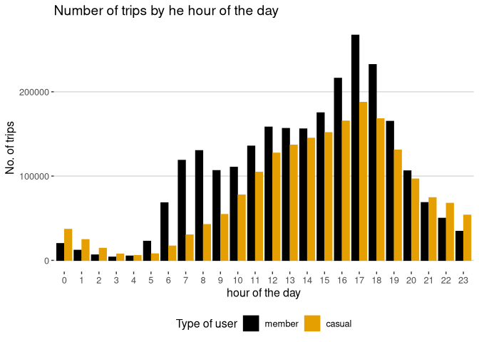<!-- -->

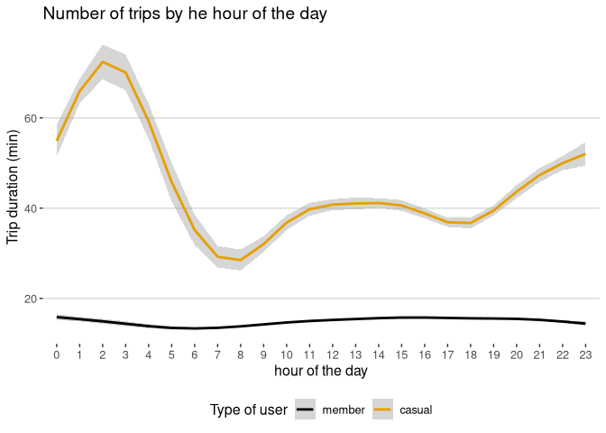<!-- -->

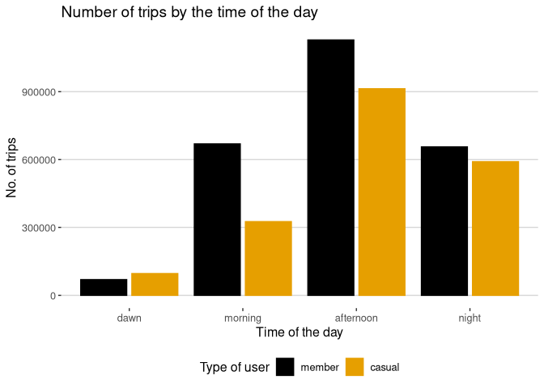<!-- -->

### By Month and Season

<!-- -->

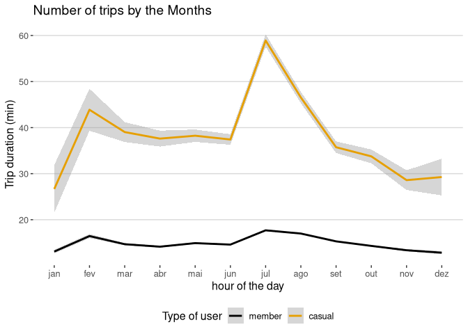<!-- -->

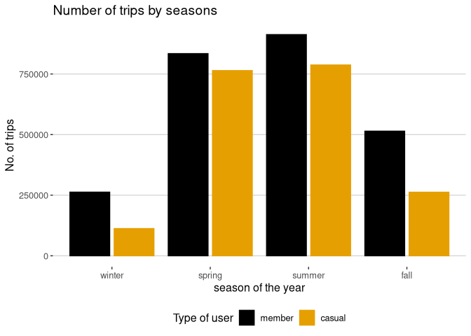<!-- -->

### By type of the bike

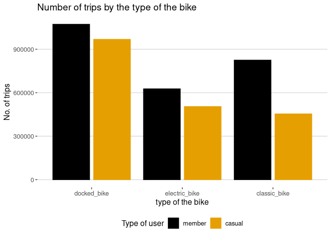<!-- -->

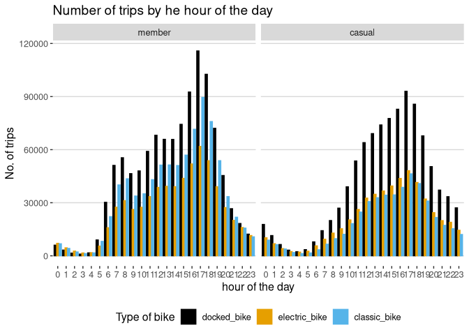<!-- -->

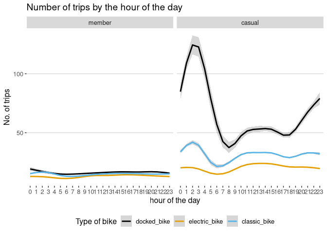<!-- -->

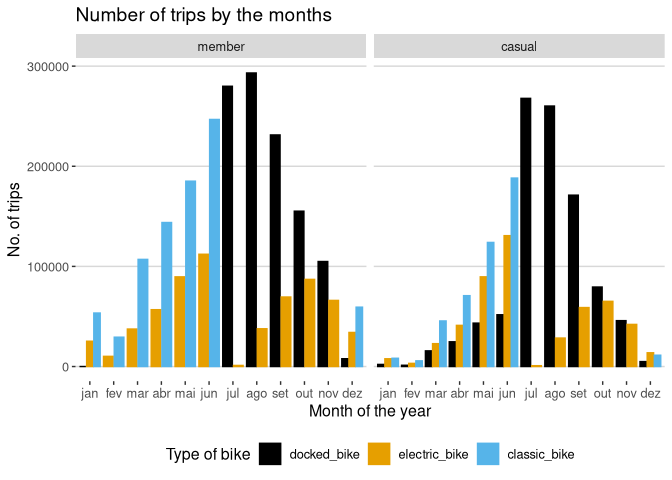<!-- -->

### Stations and the Routs more offen used

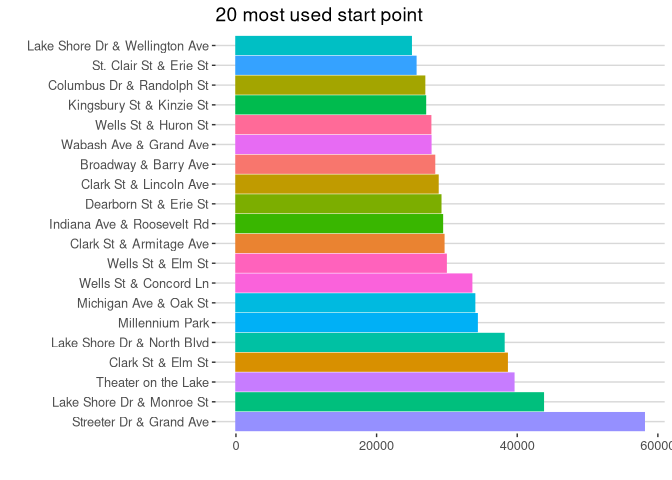<!-- -->

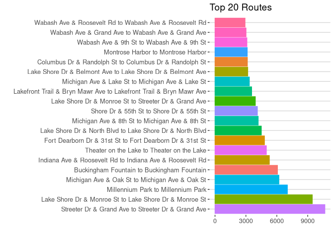<!-- -->

## Act

### Key findings

-   Different of members, casual user use service more often during the
    weekend;
-   Also have the mean duration of the trips 170% higher than members;
-   They the highest trip duration during dawn (from 12 am to 5 am) and
    at night (from 9 pm to 11 pm). With the pic at 2 am;
-   During this time (from 9 pm to 3 am) the number of trips for casual
    users are higher than members;
-   Casual users use the service mor from may to september;
-   From june to september the have the highest trip duration in the
    year;
-   use more eletrics bikes thans members.

### Recommendations

-   Create a subscription based on time-of-day to encourage casual users
    that ride from 9 pm to 5 am to subscribe;
-   Implement discounts or a points system based on loyalty (frequency
    of use ) and high trip-duration users;
-   Create seasonal subscriptions such as summer and spring. Or
    implement discounts on temporary subscriptions (3, 6, 9, 12 months);
-   Create subscription especific to ride on week day or on the weekend;
-   Create subscriptions for specific types of bicycles. Plans to use
    only electric bicycles, for example.
